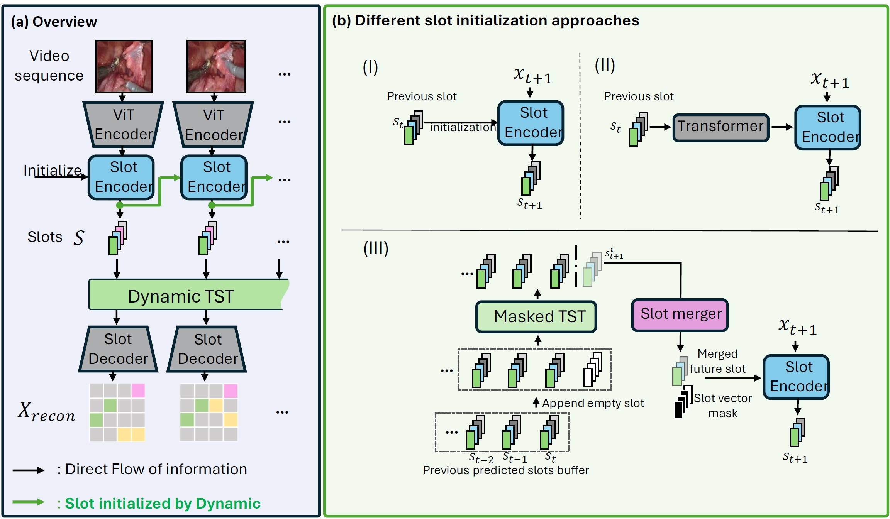

# Implementation of "Future/neXt Slot (Xslot) Prediction for Unsupervised Object Discovery in Surgical Video" - MICCAI2025


<p align="center">
  
</p>


This repository contains the official implementation for **Future Slot Prediction for Unsupervised Object Discovery in Surgical Video**. The project focuses on unsupervised object-centric learning and future slot prediction in surgical video datasets, leveraging deep learning and temporal feature modeling.

## Features

- **Unsupervised Object Discovery:** Identify and track objects in surgical videos without manual annotations.
- **Slot Attention & Prediction:** Utilizes slot-based neural architectures for object-centric representation and future state prediction.
- **Dataset Handling:** Supports multiple surgical datasets (Cholec, Thoracic, MICCAI, Endovis, etc.) with flexible configuration.
- **Load model and play & Visualization:** Includes tools for visualization, directly load pre-trained model for unsupervised transfer-learning.


## Method Overview

The figure below illustrates our approach. The model processes videos of arbitrary length and iteratively operates on a buffered latent embedding of length T, which is also the length of the attention window. A sequence of frames is encoded to obtain features. Through a recurrent iterative attention step, we obtain a set of slot representations, where each slot is a latent vector that embeds objectness for a given frame. 

These slots are then passed to a transformer encoder and a merger module that aggregates information between slots, allocates redundant slots to new objects entering the scene, removes slots for objects that exit, and merges multiple slots corresponding to different parts of the same object. Unlike convential methods (I) and (II) that ultilize simple slot initialization, our method also ultilize our DTST and slot merger modules for initialization.

A slot decoder then recurrently maps each merged slot back to the video encoding space, reconstructing the features. Simultaneously, object segmentation masks for each slot are reconstructed. The objective is to minimize the reconstruction loss between the original and reconstructed features and masks.


## Repository Structure

- `main.py` — Main script for training and prediction.
- `eval.py`, `eval_box.py`, `eval_slots.py` — Evaluation scripts for different tasks and metrics.
- `display.py`, `visual.py` — Visualization utilities (Visdom integration).
- `model/` — Model architectures, including slot attention and transformer modules.
- `dataset/` — Data loading, preprocessing, and augmentation utilities.
- `data_pre_curation/` — Scripts for preparing and curating datasets.
- `working_para/` — Parameter and configuration files for different experiments and environments.
- `working_dir_root.py` — Central configuration and dynamic import logic.

## Installation

1. **Clone the repository:**
   ```bash
   git clone https://github.com/PCASOlab/Xslot
   cd Xslot
   ```

2. **Install dependencies:**
   - This project uses PyTorch, torchvision, pytorch-lightning, numpy, visdom, and other scientific libraries.
   - You can install dependencies using pip:
     ```bash
     pip install torch torchvision pytorch-lightning numpy visdom pandas scikit-learn opencv-python
     ```
   - For advanced usage, see `video_SA/pyproject.toml` for additional dependencies.

3. **(Optional) Install and run Visdom for visualization:**
   ```bash
   pip install visdom
   python -m visdom.server
   ```

## Usage

- **Training and Evaluation:**  
   
  ```bash
  python main.py
  ```
- **Visualization:**  
  Visual outputs are available via Visdom at [http://localhost:8097](http://localhost:8097).

- **Configuration:**  
  Modify files in `working_para/` to set paths, dataset splits, and experiment parameters.


### Pretrained Models
Download the following model and place them within the [`Model_checkpoint`](./Model_checkpoint) folder
- **Abdominal model:** [Download](https://upenn.box.com/s/z3zihy27b6vufkkncmezj1aul5jh86k1)
- **Thoracic model:** [Download](https://upenn.box.com/s/secy6f7j0q1u50ccejxf6pu5w8kf3o7y)
- **Cholec model:** [Download](https://upenn.box.com/s/q8pt5ge89lhmxj7odift29vscqzwivys)


### Datasets

Support these 3 dataset, the demo is able to train with sampled data (within folder [`Data_samples`](./Data_samples)), the full curated data is available thourgh the following links:
- **Abdominal dataset:** [Download](https://upenn.box.com/s/493licnenrssjukuvok5zkvc5cqmx1nh)
- **Thoracic dataset:** [Download](https://upenn.box.com/s/rxqoi81j5ar4l343ob6otdxxeusc3iwg)
- **Cholec dataset:** [Download](https://upenn.box.com/s/ree79lv9fbibjbs2b8mkwzz207oqu6jj)


### Main Training Loop using main.py

```python
# Set checkpoint directory and training data

# MICCAI Abdominal model
CHECKPOINT_SUBDIR = "./Model_checkpoint/Abdominal/"
os.environ['WORKING_DIR_IMPORT_MODE'] = 'train_miccai'  # Change this to your target mode

# Cholec model and data
# os.environ['WORKING_DIR_IMPORT_MODE'] = 'train_cholec'  # Change this to your target mode
# CHECKPOINT_SUBDIR = "./Model_checkpoint/Cholec/"

#Thoracic model and data
# os.environ['WORKING_DIR_IMPORT_MODE'] = 'train_thoracic'  # Change this to your target mode
# CHECKPOINT_SUBDIR = "./Model_checkpoint/Thoracic/"
```


### Model and dataloader configuration
```python

# Chnage the default setting of model
Model_infer = model_infer_slot_att._Model_infer(parser.parse_args(),GPU_mode,num_gpus,Using_contrast=False,Using_SP_regu = False,Using_SP = True,Using_slot_bert=True,slot_ini= "binder+merger",Sim_threshold=0.90,gpu_selection=Gpu_selection,pooling="max",TPC=True)

device = Model_infer.device
dataLoader = myDataloader(img_size=img_size, ...)

if Continue_flag:
    Model_infer.model.load_state_dict(torch.load(CHECKPOINT_SUBDIR + 'model' + loadmodel_index))
```


### Run and Obtain Output

To run inference and generate results, execute:

```bash
python main.py
```

The predicted frame mask stacks will be saved in the [`Data_samples/output/`](./Data_samples/output/) directory.

## Video stream scene decomposation
 
Our method is able to optimially decompose the scene with fast inference, preventing over- or under- grouping of object or tissue. It is demonstrated that it is also able to handle videos with  different FPS after it is trained 1 FPS. Note that the forward time per frame on a single NVIDIA RTX A6000 GPU is 5.6 ms, supporting real-time downstream tasks. While slot merging and future slot prediction add 3.9 ms overhead compared to Slot-BERT (1.7 ms), this remains minor. Even with a 20X larger context window, latency stays under 100 ms thanks to latent-space temporal reasoning.


<p align="center">
  
</p>

## Acknowledgement 
We thank the authors of the following projects for open-sourcing their code:
 [VideoSAUR](https://github.com/martius-lab/videosaur); [DINOSAUR](https://github.com/facebookresearch/dinosaure); [ SAVi](https://github.com/google-research/slot-attention-video);[STEVE](https://github.com/google-research/steve); [Slot-Diffusion](https://github.com/thu-ml/SlotDiffusion);[AdaSlot](https://github.com/amazon-science/AdaSlot).

## Citation

If you use this codebase, please cite:

```
@inproceedings{liao_future2025,
  title={Future Slot Prediction for Unsupervised Object Discovery in Surgical Video},
  author={Guiqiu Liao, Matjaz Jogan, Marcel Hussing, Edward Zhang, Eric Eaton, Daniel A. Hashimoto},
  booktitle={Medical Image Computing and Computer Assisted Intervention – MICCAI 2025},
  year={2025}
}
```

## License

This project is for academic research purposes only.

